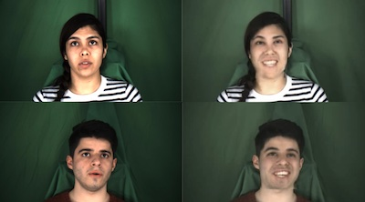

# Wav2Lip-Emotion

### ADGD @ ACM Multimedia 2021 [paper](literature/ADGD_2021_Wav2Lip-emotion.pdf)



Wav2Lip-Emotion takes existing videos (real neutral inputs on left) and modifies facial expressions of emotion (generated happy outputs on right) while maintaining speakers' lip synchronization and pose. Examples here are from all-around best model on unseen faces.

## Abstract

We present Wav2Lip-Emotion, a video-to-video translation architecture that modifies facial expressions of emotion in videos of speakers. Previous work modifies emotion in images, uses a single image to produce a video with animated emotion, or puppets facial expressions in videos with landmarks from a reference video. However, many use cases such as modifying an actor's performance in post-production, coaching individuals to be more animated speakers, or touching up emotion in a teleconference require a video-to-video translation approach. We explore a method to maintain speakers' lip movements, identity, and pose while translating their expressed emotion. Our approach extends an existing multi-modal lip synchronization architecture to modify the speaker's emotion using L1 reconstruction and pre-trained emotion objectives. We also propose a novel automated emotion evaluation approach and corroborate it with a user study. These find that we succeed in modifying emotion while maintaining lip synchronization. Visual quality is somewhat diminished, with a trade off between greater emotion modification and visual quality between model variants. Nevertheless, we demonstrate (1) that facial expressions of emotion can be modified with nothing other than L1 reconstruction and pre-trained emotion objectives and (2) that our automated emotion evaluation approach aligns with human judgements.

## setup
```
git clone https://github.com/jagnusson/Wav2Lip-Emotion.git
```
### docker
```
# inside repo top directory use Dockerfile there
cd Wav2Lip-Emotion
docker build -t <image name>:<version tag> .
docker run --gpus all -dit -v /Wav2Lip-Emotion:/Wav2Lip-Emotion <image name>-<version tag> <image name>:<version tag>
docker exec -it <image name>-<version tag> bash
```
### python dependencies
```
# install python reqs
cd Wav2Lip-Emotion
pip3 install -r requirements.txt
```

## model checkpoints
Model checkpoints will be released soon for our finished models, as well as our re-trainings of Wav2Lip original with modified masking strategy and visual quality descriminator to account for expressions of emotion in the full face. Other model checkpoints to be aware of are the [lipsync expert](https://iiitaphyd-my.sharepoint.com/:u:/g/personal/radrabha_m_research_iiit_ac_in/EQRvmiZg-HRAjvI6zqN9eTEBP74KefynCwPWVmF57l-AYA?e=ZRPHKP) used by Wav2Lip provided by the original authors, the [pre-trained emotion objective](https://drive.google.com/file/d/1f8wUtQj-UatrZtCnkJFcB--X2eJS1m_N/view) from Pham, Vu, and Tran (2021), and the [facial landmark detector](https://github.com/codeniko/shape_predictor_81_face_landmarks/blob/master/shape_predictor_81_face_landmarks.dat) which we use for full face masking. These model checkpoints are necissary if you with to train the model yourself as described in the next section, and should be placed in the `checkpoints` dir.

## train it yourself
### pre-processing
All data should be pre-processed to extract faces and (optionally) apply full face masking. If the data (such as MEAD) isnt already at 25 fps you should resample it to match this frame rate in the LRS2 data using `scripts/resample_and_resize.sh`
```
python3 preprocess.py --data_root <root of dataset> --preprocessed_root <output dir>
# also create full masks if you want to
bash scripts/mask_dataset.sh <dir with preprocessed data>
```
### Wav2Lip pre-training
It is necissarry to redo the Wav2Lip original model training as we modify the masking strategy and visual quality descriminator to account for expressions of emotion in the full face. To do so you need to obtain access to the original [LRS2 dataset](https://www.robots.ox.ac.uk/~vgg/data/lip_reading/lrs2.html).

```
python3 wav2lip-emotion_train.py --data_root <dir with preprocessed data> --checkpoint_dir <dir to place model checkpoints> --syncnet_checkpoint_path <pre-trained sync objective weights>
```
Further hyperparameters such as task weights are present in `hparams.py`. Ensure to disable affect task weight until you are ready to train that objective (next section). The timeline for other task weights is discussed in the original Wav2Lip repo.

### Wav2Lip-Emotion training on MEAD
First make sure that you pre-processed the MEAD data as described in the previous section. Now using that data and the pre-trained Wav2Lip components (re-trained in the last section) we can introduce the emotion objective and also pass in target video frames from a destination affect to alow the l1 reconstruction objective to modify emotion:

```
python3 wav2lip-emotion_train.py --data_root <dir with preprocessed source emotion data> --dest_affect_root <dir with preprocessed destination emotion data> --checkpoint_dir <dir to place model checkpoints> --syncnet_checkpoint_path <pre-trained sync objective weights> --checkpoint_path <generator weights> --disc_checkpoint_path <visual quality descriminator weights> --affect_checkpoint_path <affect objective weights>
```
Further hyperparameters such as task weights are present in `hparams.py`. Ensure that the affect task weight and the `gt_dest_affect` and `mask_dest_affect` are set for use of destination affects. Furthermore the desired affect is set by `desired_affect`.

## Evaluation
For details on evaluation see the readme in side the evaluation directory.

